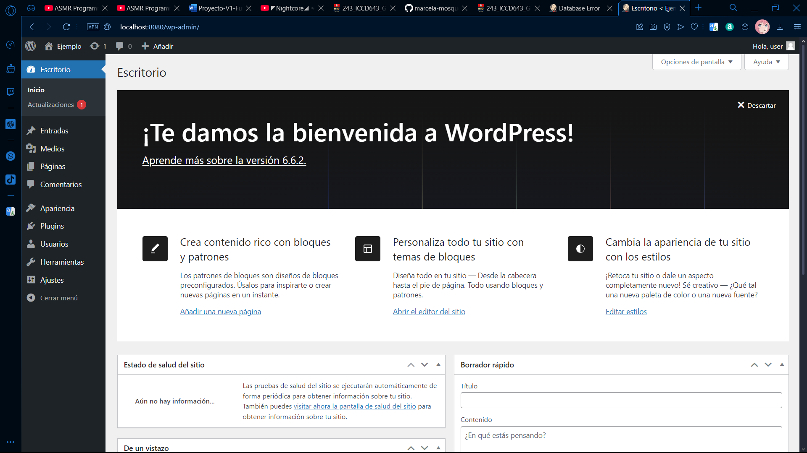
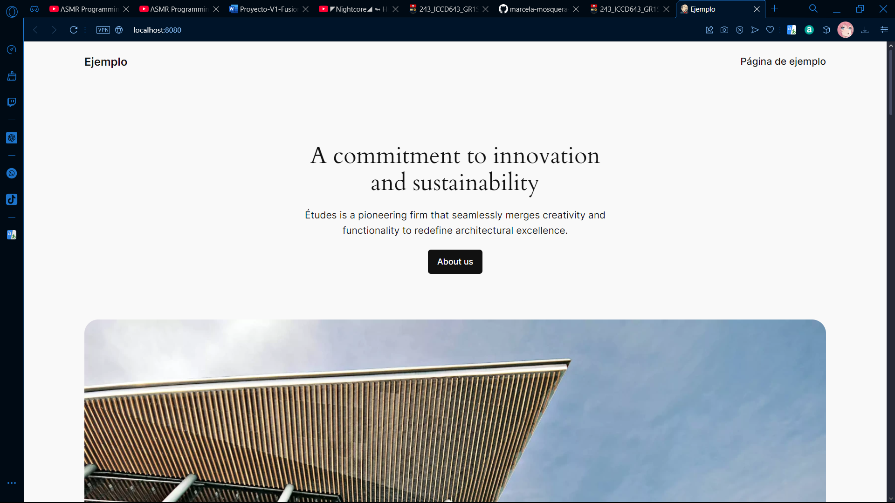

## Esquema para el ejercicio


### Crear la red

```
docker network create net-wp -d bridge
```

### Crear el contenedor mysql a partir de la imagen mysql:8, configurar las variables de entorno necesarias

```
docker run -d --name mysql --network net-wp -e MYSQL_ROOT_PASSWORD=123 -e MYSQL_DATABASE=wordpress -e MYSQL_USER=user -e MYSQL_PASSWORD=123 mysql:8
```

### Crear el contenedor wordpress a partir de la imagen: wordpress, configurar las variables de entorno necesarias

```
docker run -d --name wordpress --network net-wp -e WORDPRESS_DB_HOST=mysql:3306 -e WORDPRESS_DB_USER=user -e WORDPRESS_DB_PASSWORD=123 -e WORDPRESS_DB_NAME=wordpress -p 8080:80 wordpress
```

De acuerdo con el trabajo realizado, en la el esquema de ejercicio el puerto a es **(completar con el valor)**

Ingresar desde el navegador al wordpress y finalizar la configuración de instalación.



Desde el panel de admin: cambiar el tema y crear una nueva publicación.
Ingresar a: <http://localhost:8080/>
recordar que a es el puerto que usó para el mapeo con wordpress



```
docker rm -f wordpress
```

### Crear nuevamente el contenedor wordpress

Ingresar a: <http://localhost:8080/>
recordar que a es el puerto que usó para el mapeo con wordpress

### ¿Qué ha sucedido, qué puede observar?

Se ingresa directamente al sitio web, sin realizar la instalación anterior.
